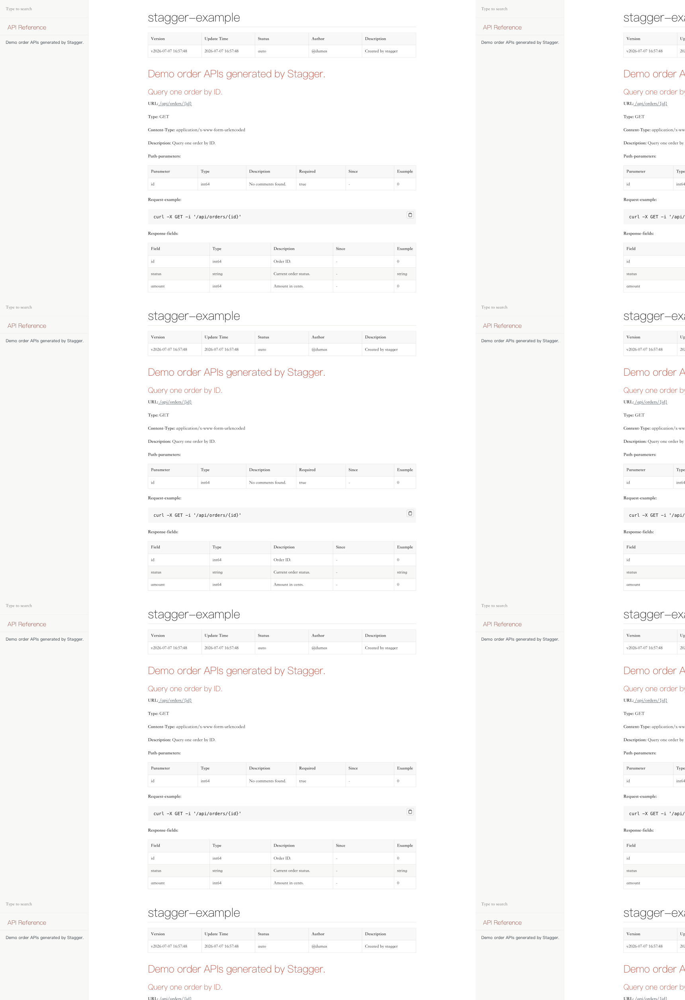
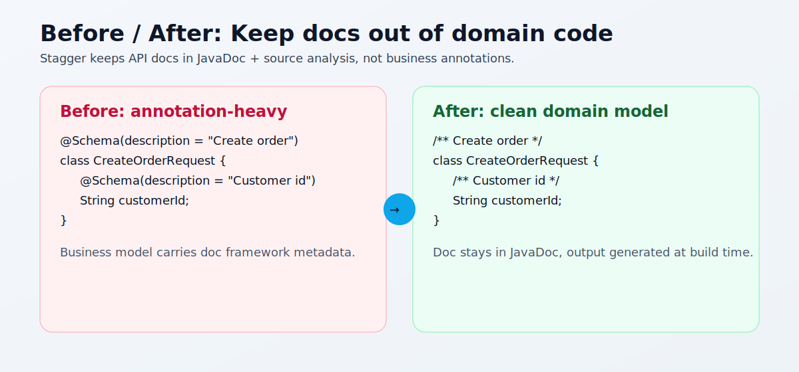

# Stagger

[English Version](./README.md)

[](https://github.com/HsinDumas/stagger/actions/workflows/ci.yml)
[](https://central.sonatype.com/artifact/com.github.hsindumas/stagger-core)
[](https://plugins.gradle.org/plugin/com.github.hsindumas.stagger)
[](./LICENSE)

> **Let Swagger stagger. Keep your source code pristine.**

Swagger 想让你的业务代码背文档注解。
Stagger 说不。

Stagger 是一款基于 JavaParser 静态分析的 **零侵入、零注解** API 文档生成工具。
它源于 smart-doc 思路并独立维护，重点面向现代 Java 工程实践（JDK 25 toolchain、Gradle 9.x、Spring Boot 4 兼容）。

## 👀 生成效果预览

下面是仓库内置示例项目生成的离线 HTML 文档效果：



Before/After 代码风格对比：



## 🎯 适合谁用

- 不想让 Swagger 注解污染业务模型的团队。
- 想沿用 smart-doc 思路但需要现代化工具链的团队。
- 正在升级新 JDK / 新 Spring Boot 基线的 Java 项目。

## ⚡ 一分钟理解 Stagger

- 文档不要侵入领域模型。
- 直接解析源码结构与 JavaDoc。
- 在构建期输出 OpenAPI 3.1、Markdown、离线 HTML。
- 对用户保持 Maven/Gradle 双一等支持。

## 💡 为什么叫 Stagger？

当文档系统开始反向塑造领域模型时，代码就失去边界了。

Stagger 的选择是把文档生成放在构建期源码分析，而不是业务注解堆砌。

### Before / After

```java
// Before：文档框架驱动业务模型形态
@Schema(description = "创建订单请求")
public class CreateOrderRequest {
    @Schema(description = "客户ID")
    private String customerId;
}

// After（Stagger）：模型保持干净，文档交给 JavaDoc + 源码分析
/** 创建订单请求 */
public class CreateOrderRequest {
    /** 客户ID */
    private String customerId;
}
```

核心原则：

- 🚫 **零侵入** - 业务代码无需引入第三方文档注解。
- 📝 **JavaDoc + 源码元信息** - 从源码结构和注释推导文档。
- ⚡ **现代 Java 优先** - 重点支持 JDK 25 toolchain 与新框架兼容。
- 🔄 **多格式输出** - 一次构建可生成 OpenAPI 3.1、Markdown、离线 HTML。

## ✨ 功能对比

| 特性 | Stagger | Swagger | springdoc-openapi |
|------|---------|---------|------------------|
| 零代码侵入 | ✅ | ❌ | ❌ |
| 纯 JavaDoc | ✅ | ❌ | ❌ |
| 构建时生成 | ✅ | ❌ | ❌ |
| Gradle 9.x | ✅ | ✅ | ✅ |
| OpenAPI 3.1 | ✅ | ✅ | ✅ |

## 🚀 5 秒上手 Demo（克隆即跑）

```bash
git clone https://github.com/HsinDumas/stagger.git
cd stagger
./gradlew :example:restHtml
open example/build/stagger/index.html
```

你将得到：

- `example/build/stagger/index.html` 的离线 HTML 文档。
- `example/src/main/java` 下最小 Controller + DTO 示例。
- `example/src/main/resources/stagger.json` 可直接修改验证。

## 🔍 与 smart-doc 的差异化

理念一致，工程路线不同：

| 维度 | 上游基线 | Stagger（本仓库） |
|------|--------------------|-------------------|
| 项目定位 | 上游通用基线 | 独立维护分支，明确现代化路线图 |
| 构建体系 | Maven 为主 | Gradle Monorepo 为主（同时提供 Maven/Gradle 一等插件） |
| 解析架构 | QDox 体系 | JavaParser SourceModel 抽象 |
| JDK 策略 | 传统基线 | JDK 25 toolchain 构建，产物保持向下兼容目标 |
| Spring 侧重点 | 常规 Spring 生态 | 强化 Spring Boot 4 与新注解形态兼容 |
| 迁移透明度 | N/A | 公开迁移记录：`docs/CODEX_MIGRATION_PLAN.md` |

Stagger 在仓库内部使用 Gradle 构建，但不会强迫用户切换构建工具；Maven 与 Gradle 用户体验都保持一等支持。

## 🙏 致敬 smart-doc

Stagger 的起点来自 [smart-doc](https://github.com/smart-doc-group/smart-doc)。
我们延续“尽量不侵入业务代码”的理念，并向 [shalousun](https://github.com/shalousun) 与所有贡献者致敬。

## 📚 Wiki

- GitHub Wiki：https://github.com/HsinDumas/stagger/wiki
- 文档索引：`docs/wiki/README.md`
- `stagger.json` 配置参考（中文）：`docs/wiki/stagger-json-cn.md`
- `stagger.json` configuration reference (EN)：`docs/wiki/stagger-json.md`

## 🚀 快速开始

以下示例直接使用 `3.2.1`，可复制即用。
最新版本请查看：https://github.com/HsinDumas/stagger/releases（标签格式：`vX.Y.Z`）。

### Maven

```xml
<plugin>
    <groupId>com.github.hsindumas</groupId>
    <artifactId>stagger-maven-plugin</artifactId>
    <version>3.2.1</version>
    <configuration>
        <configFile>${project.basedir}/src/main/resources/stagger.json</configFile>
    </configuration>
    <executions>
        <execution>
            <goals>
                <goal>html</goal>
            </goals>
        </execution>
    </executions>
</plugin>
```

```bash
mvn -Dfile.encoding=UTF-8 stagger:html
```

### Gradle

```kotlin
plugins {
    id("com.github.hsindumas.stagger") version "3.2.1"
}

stagger {
    configFile = file("src/main/resources/stagger.json")
}
```

```bash
./gradlew restHtml
# 可选：命令行覆盖配置文件路径
./gradlew restHtml -Pstagger.configFile=src/main/resources/stagger.json
```

### 最小 `stagger.json` 示例

```json
{
  "allInOne": true,
  "isStrict": false,
  "outPath": "build/stagger"
}
```

## 🔧 构建

```bash
# 构建全部模块
./gradlew clean build -x test

# 构建指定模块
./gradlew :stagger-core:build -x test
./gradlew :stagger-maven-plugin:build -x test
./gradlew :stagger-gradle-plugin:build -x test
```

## 📄 许可证

Apache License 2.0 - 详见 LICENSE 文件

## 🤝 贡献

欢迎提交 Pull Request！大改动请先开 Issue 讨论。

## 👏 致谢

- **上游项目**: [smart-doc](https://github.com/smart-doc-group/smart-doc)
- **当前维护**: [HsinDumas](https://github.com/HsinDumas)
